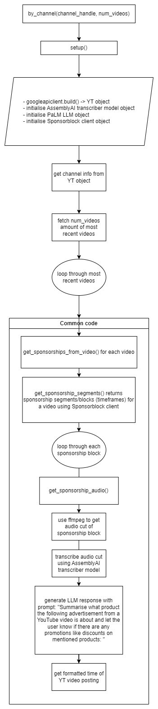
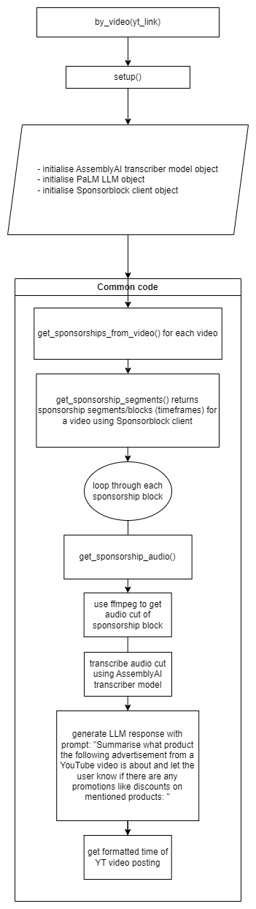

# get-youtube-sonsorships
Get information on the paid sponsorship deals of YouTubers in their latest videos.

## Flowcharts of algorithms

### By Channel: Select N most recent videos for a channel and get sponsorships in them

### By Video: Simple sponsorship retrieval from a single video

## Flask web application screenshots

